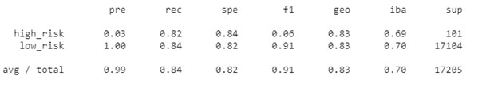
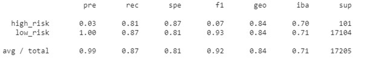
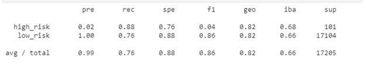
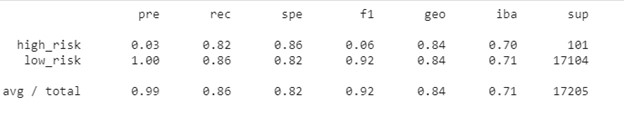
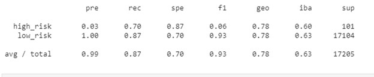

# Unit 11—Risky Business

## Credit Risk Resampling Techniques

### Oversampling

#### Naive Random Sampling

#### SMOTE Oversampling
SMOTE_class_report

### Undersampling

#### Cluster Centroids

### Combination (Over and Under) Sampling

#### SMOTEENN 

## Credit Risk Ensemble 

#### Balanced Random Forest Classifier

#### Easy Ensemble Classifier
