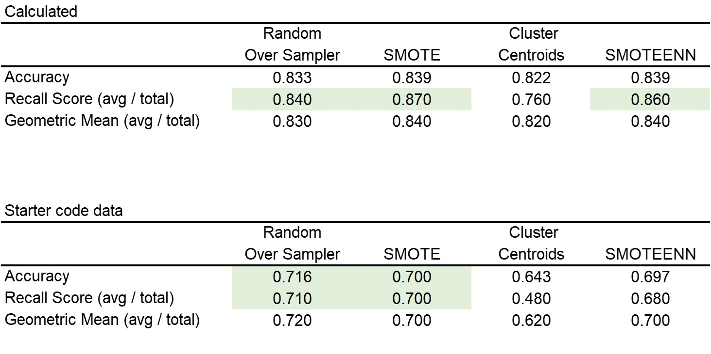
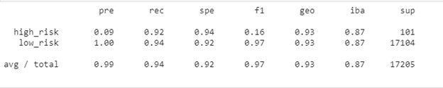

# Unit 11—Risky Business

## Credit Risk Resampling Techniques

summary_results-part1

The table above shows a discrepancy between the calculated numbers and the numbers already in the starter code. 

Using the starter code numbers, the model with the highest accuracy score is the random over sampler followed by SMOTE (Synthetic Minority Oversampling Technique). The best recall is also for these two models. Lastly, the geometric mean is also highest for the random over sampler model and the SMOTE has a similar score than the SMOTEENN (SMOTE + Edited Nearest Neighbor)

The accuracy of the first two might be driven by the overfitting that those models tend to do when they increase the size of the minority class, in this case, the high risk loans. 

## Credit Risk Ensemble 

Based on the table above, the Easy Ensemble Classifier has the highest accuracy model, recall score and geometric mean, making in the model of choice for LendingClub data. 

The top 3 features are total_rec_prncp, total_pymnt, total_pymnt_inv followed by other metrics that seem counterituitive. 

When comparing this to the features in the starter code, there seems to be a discrepancy. The starter code, shows loan_amnt, int_rate and instalrmment followed by annual_inc, dti, delinq_2yrs. These features are more closely related to loan performance than the ones identified by the model I ran. 

## Appendix - Credit Risk Resampling Techniques - Classification Reports

### Oversampling

#### Naive Random Sampling

#### SMOTE Oversampling
SMOTE_class_report

### Undersampling

#### Cluster Centroids

### Combination (Over and Under) Sampling

#### SMOTEENN 

## Appendix - Credit Risk Ensemble - Classification Reports

#### Balanced Random Forest Classifier

#### Easy Ensemble Classifier
